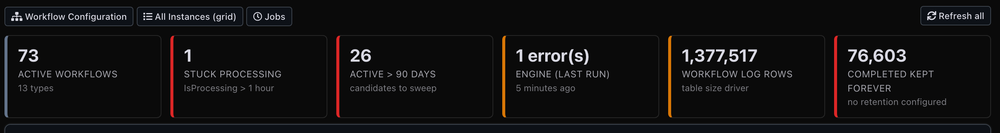
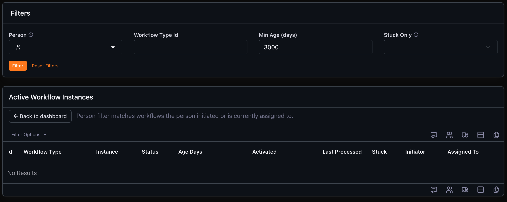
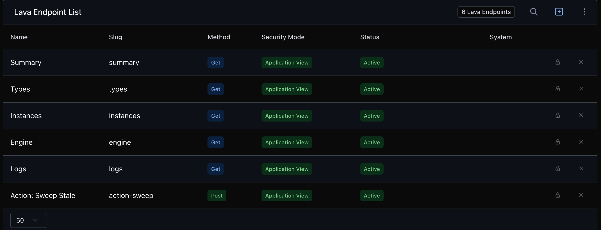

# Deploying the Workflow Health Dashboard

A step-by-step guide for a Rock administrator (or an AI agent working on their behalf). There
are two ways to install, and both build the **same** thing from the **same** source files in
this folder:

- **Path A — scripted:** run `provision.py` once. Fast, idempotent, self-verifying.
- **Path B — by hand:** click it together in the admin UI. No API key needed; screenshots below.

Do the **Prerequisites** first either way. Steps that only a person with admin/SQL access
should do are marked **[admin]**; everything else is safe for an agent to run.

## What you'll end up with

A single dashboard page — a strip of live KPIs across the top, then panels for engine health,
workflow types, the longest-running instances, and log/retention hygiene:



…and a filterable, exportable grid of every active instance (filter by person, type, age, or
"stuck"):



The same data is available to AI agents as JSON (`?format=json` on any read endpoint).

---

## Phase 0 — Prerequisites [admin]

**0.1 Confirm your Rock version.** Lava Applications require **v17+**; this recipe is verified
on **19.3.1**. View-source on any Rock page and read `<meta name="generator" content="Rock
vX.Y.Z.W" />`. Below 19.x, re-verify the CSRF-header behavior noted in `README.md` before
relying on the endpoints.

**0.2 Pick a REST key and confirm its identity.** You need a REST key whose person belongs to
an **admin security role** (Rock's built-in **RSR - Rock Administration** is the default the
script grants; use your own by setting `WFH_ADMIN_ROLE`). Confirm it works read-only:

```bash
curl -s -o /dev/null -w "%{http_code}\n" "$WFH_BASE_URL/api/Campuses" \
  -H "Authorization-Token: $WFH_API_KEY"        # expect 200
```

**0.3 Grant v2 REST access to that role.** The Lava application and endpoint entities are
**v2-only**, and Rock's v2 controllers default to *no* access until a role is granted **Execute**
on them. Grant your admin role Execute on the v2 REST controllers (Admin Tools → Security → REST
Controllers), then **clear the Rock cache**. This is the single most common reason a first run
fails. Verify the grant took:

```bash
curl -s -o /dev/null -w "%{http_code}\n" -X POST \
  "$WFH_BASE_URL/api/v2/models/blocktypes/search" \
  -H "Authorization-Token: $WFH_API_KEY" -H "Content-Type: application/json" \
  -d '{"where":"Id > 0","isCountOnly":true}'    # expect 200; 401/403 = grant missing
```

(If you'd rather not grant v2 API access at all, skip Path A and build it by hand — Path B needs
no API key.)

**0.4 Base URL.** Use your Rock base URL for `$WFH_BASE_URL`. If you sit behind a CDN/proxy,
prefer an origin host that bypasses it for the API calls, so nothing is cached or challenged.

**0.5 Decide where the page lives.** By default the dashboard is created under the stock **Power
Tools** page. To place it elsewhere in your admin tree, note the id of the page you want it
under and pass it as `WFH_PARENT_PAGE_ID`. This is your call — the recipe doesn't assume a home.

**0.6 Accept the write surface.** The dashboard ships action buttons (expire an instance, clear
a stuck flag, set a log-retention period, bulk-sweep a type's stale instances). Single-instance
actions call the v1 REST API as the signed-in admin; the bulk sweep POSTs to a secured
`action-sweep` endpoint (30-day floor, 500-row cap, audit-stamped to the caller). Confirm that
posture is acceptable, and that only your admin role can reach it (the script enforces this).

**Checkpoint:** version known, key verified (0.2 = 200), v2 grants verified (0.3 = 200), base URL
chosen, page location decided, write posture accepted.

---

## Phase 1 — Pre-flight (optional, read-only)

`provision.py` discovers everything it needs and aborts with a clear message if anything is
ambiguous, so this SQL is optional — but it's a quick way to see collisions and missing
prerequisites up front. Run it read-only in **Admin Tools → Power Tools → SQL Command** (or any
SQL client):

```sql
SET NOCOUNT ON
-- Nothing may already claim the app slug, routes, page names, or metric titles (expect 0 rows each)
SELECT 'APP SLUG' AS [Check], [Id], [Slug] FROM [LavaApplication] WHERE [Slug] = 'workflow-health'
SELECT 'ROUTES' AS [Check], [Route], [PageId] FROM [PageRoute] WHERE [Route] LIKE '%workflow-health%'
SELECT 'PAGES' AS [Check], [Id], [InternalName] FROM [Page] WHERE [InternalName] IN ('Workflow Health','Workflow Health - Instances')
SELECT 'METRICS' AS [Check], [Id], [Title] FROM [Metric] WHERE [Title] IN ('Active Workflows','Stuck Workflow Processing','Workflow Log Rows','Completed Workflows Kept Forever')

-- Discovery preconditions: each must return exactly ONE row
SELECT 'BT DynamicData' AS [Check], [Id] FROM [BlockType] WHERE [Path] = '~/Blocks/Reporting/DynamicData.ascx'
SELECT 'BT PageParameterFilter' AS [Check], [Id] FROM [BlockType] WHERE [Path] = '~/Blocks/Reporting/PageParameterFilter.ascx'
SELECT 'BT LavaApplicationContent' AS [Check], [Id] FROM [BlockType] WHERE [Name] = 'Lava Application Content' AND [Path] IS NULL
SELECT 'ADMIN ROLE' AS [Check], [Id] FROM [Group] WHERE [Name] = 'RSR - Rock Administration' AND [IsSecurityRole] = 1
SELECT 'DV SQL source type' AS [Check], [dv].[Id] FROM [DefinedValue] AS [dv] JOIN [DefinedType] AS [dt] ON [dt].[Id] = [dv].[DefinedTypeId] WHERE [dt].[Name] = 'Source Value Type' AND [dv].[Value] = 'SQL'
SELECT 'METRIC SCHEDULE' AS [Check], [Id] FROM [Schedule] WHERE [Name] = 'Daily 3 AM Metric'
SELECT 'JOBS PAGE ROUTE' AS [Check], [PageId] FROM [PageRoute] WHERE [Route] = 'admin/system/jobs'

-- Supporting jobs are alive
SELECT 'JOBS' AS [Check], [Id], [Name], [IsActive], [CronExpression] FROM [ServiceJob]
WHERE [Class] IN ('Rock.Jobs.ProcessWorkflows','Rock.Jobs.CompleteWorkflows','Rock.Jobs.CalculateMetrics')
```

| Result | Action |
|---|---|
| Any of the first four checks returns rows | Something is already deployed (or half-deployed). Reconcile before running the script. |
| A discovery check returns 0 or 2+ rows | Fix the ambiguity — e.g. no `Daily 3 AM Metric` schedule → set `WFH_METRIC_SCHEDULE` to a daily schedule you have, or plan to run with `WFH_SKIP_METRICS=1`. |
| `admin/system/jobs` route missing | Pass `WFH_JOBS_PAGE_ID` explicitly (find your Jobs Administration page id in Admin Tools). |
| Calculate Metrics inactive | Metrics never populate — reactivate the job, or run with `WFH_SKIP_METRICS=1`. |

---

## Path A — Provision with the script [agent-ok after Phase 0]

```bash
cd workflow-health-dashboard
export WFH_BASE_URL="https://rock.example.org"
export WFH_API_KEY="<your admin REST key>"        # never commit or echo this
# export WFH_PARENT_PAGE_ID=123                    # optional — defaults to stock Power Tools

python3 provision.py
```

The script prints each object it finds or creates and ends with an **inventory JSON — save it**;
that's your rollback map. It only *adds* named objects, so re-running is safe and changes
nothing that already matches.

| Symptom | Cause / fix |
|---|---|
| `v2 search ... failed (401/403)` | Phase 0.3 grants missing, or the cache wasn't cleared after granting |
| `DISCOVERY FAILED: expected exactly 1 ...` | A Phase 1 precondition isn't met — read the message, fix, re-run |
| `route ... already exists but points at page N` | A route name collides — rename via `WFH_DASHBOARD_ROUTE`/`WFH_INSTANCES_ROUTE`, or clear the old one |
| A large attribute write 500s then hangs | A prior aborted request's lock — wait ~2 minutes and re-run (idempotent) |
| `schedule ... found 0` | No `Daily 3 AM Metric` — set `WFH_METRIC_SCHEDULE` or `WFH_SKIP_METRICS=1` |

Then jump to **Phase 3 — Verification**.

---

## Path B — Build it by hand in the admin UI [admin]

No API key required. You're recreating exactly what the script does; the source files in this
folder are the content to paste. Wherever a template contains a `__WFH_*__` token, replace it
with the real page id once you've created that page:

- `__WFH_DASHBOARD_PAGE_ID__` → your new Workflow Health page id
- `__WFH_INSTANCES_PAGE_ID__` → your new Workflow Health - Instances page id
- `__WFH_JOBS_PAGE_ID__` → your Jobs Administration page id

**1. Create the Lava application.** Admin Tools → CMS Configuration → **Lava Applications** →
add one named **Workflow Health**, slug `workflow-health`, active. (The UI initializes the
configuration correctly, so you won't hit the null-rigging gotcha.)

**2. Add the six endpoints.** On the application, add each endpoint from the table below,
pasting the matching file from `endpoints/` (tokens substituted) as its code template. Set
**Enabled Lava Commands = Sql** and **Security Mode = Application View** on every one. When
you're done, the application's endpoint list looks like this:

| Slug | Method | File |
|---|---|---|
| `summary` | GET | `endpoints/ep-summary.lava` |
| `types` | GET | `endpoints/ep-types.lava` |
| `instances` | GET | `endpoints/ep-instances.lava` |
| `engine` | GET | `endpoints/ep-engine.lava` |
| `logs` | GET | `endpoints/ep-logs.lava` |
| `action-sweep` | POST | `endpoints/ep-action-sweep.lava` |



**3. Set security.** On the **application**: grant your admin role **View, Edit, Administrate,
and ExecuteView**, then add a **Deny** for **All Users** on **ExecuteView** (ordered below the
allow). On the **action-sweep** endpoint, the same allow/deny for **Execute**.

**4. Create the two pages.** Under the parent you chose in 0.5 (Power Tools by default), add a
page **Workflow Health** (icon `fa fa-heartbeat`). Under *that* page, add a child **Workflow
Health - Instances** (Display In Nav → Never, **Enable View State → On** — the classic Dynamic
Data block needs it). Optionally add the pretty routes `admin/power-tools/workflow-health` and
`.../instances`.

**5. Add the blocks.**
- On **Workflow Health**: add a **Lava Application Content** block → Application = *Workflow
  Health*, and paste `dashboard-block.lava` (tokens substituted) as its template.
- On **Workflow Health - Instances**: add a **Page Parameter Filter** block with four filters —
  `Person` (Person), `WorkflowTypeId` (Integer), `MinAgeDays` (Integer), `StuckOnly` (Boolean) —
  above a **Dynamic Data** block: Query = `dd-instances-query.sql`, Query Params
  `WorkflowTypeId=0,MinAgeDays=0,StuckOnly=0,Person=`, Url Mask `/Workflow/{Id}`, Grid Header =
  `dd-grid-header.html`, with Excel export, grid filter, and panel on, timeout 30.

**6. Add the metrics (optional).** Reporting → Metrics → new category **Workflow Health** → four
SQL metrics on a daily schedule, per the `METRICS` list in `provision.py` (each with one default
partition). Skip this if you don't want the trend data.

Then continue to Phase 3.

---

## Phase 3 — Verification

**Endpoint security gates and JSON** (read-only — safe to run anywhere):

```bash
B="$WFH_BASE_URL/api/v2/lava-app/1/workflow-health"
K="Authorization-Token: $WFH_API_KEY"
C="X-Helix-CSRF-Protection: true"

curl -s -o /dev/null -w "anon, no header -> %{http_code} (expect 401)\n" "$B/summary"
curl -s -o /dev/null -w "key + CSRF      -> %{http_code} (expect 200)\n" "$B/summary" -H "$K" -H "$C"

for ep in "summary" "types" "instances?top=5" "engine" "logs"; do
  echo "== $ep"; curl -s "$B/$ep?format=json" -H "$K" -H "$C" | head -c 160; echo; done
```

**In a browser**, open the dashboard page (`/page/<dashboard id>`):

1. The KPI strip paints immediately; all five panels fill in; numbers look plausible.
2. Click a workflow id → Workflow Detail; a type name → Workflow Configuration; a KPI card →
   the instances grid with that filter applied.
3. On the instances grid: pick a person → rows narrow to theirs; set Min Age 90 → the count
   matches the ">90 days" KPI; the Excel export downloads.
4. The Engine panel shows the Process Workflows status and the Complete Workflows cadence.

**Do not test the sweep/expire actions on production data as a verification step** — let the
first real write be a deliberate admin action on a genuinely stale instance.

**Checkpoint:** security gates behave, five endpoints return JSON, the browser walk-through is clean.

---

## Phase 4 — Post-deploy [admin]

1. **Clear the Rock cache** (Admin Tools → System Information) — this activates the pretty
   routes. `/page/{id}` links already work without it.
2. **Metrics** populate at the next run of their schedule; confirm rows in Metric Values the
   next day. (KPI sparklines are a nice follow-up once a few days accumulate.)
3. **Consider the Complete Workflows job's cadence.** On many instances it runs infrequently by
   default, which means a workflow type's **Max Workflow Age** barely takes effect (age-based
   auto-expiry only happens when this job runs). If you rely on Max Workflow Age, preview what a
   run would expire first:

   ```sql
   SELECT [wt].[Name], [wt].[MaxWorkflowAgeDays], COUNT(*) AS [WouldExpire]
   FROM [Workflow] AS [w]
   JOIN [WorkflowType] AS [wt] ON [wt].[Id] = [w].[WorkflowTypeId]
   WHERE [w].[CompletedDateTime] IS NULL AND ISNULL([wt].[MaxWorkflowAgeDays], 0) > 0
     AND [w].[ActivatedDateTime] < DATEADD(DAY, -[wt].[MaxWorkflowAgeDays], GETDATE())
   GROUP BY [wt].[Name], [wt].[MaxWorkflowAgeDays]
   ```

   If the counts are acceptable, set the job to a daily cadence (e.g. cron `0 0 4 1/1 * ? *`).

---

## Rollback

Everything the provisioner created is in its inventory JSON. Remove in this order (v1 API or
the admin UI):

1. Blocks: the three created block ids (dashboard, filters, grid) — `DELETE /api/Blocks/{id}`
2. Child instances page (its routes go with it) — `DELETE /api/Pages/{instances id}`
3. Dashboard page (this recipe created it) and its route — `DELETE /api/Pages/{dashboard id}`
4. Endpoints then the application — `DELETE /api/v2/models/lavaendpoints/{id}` ×6, then
   `DELETE /api/v2/models/lavaapplications/{id}` (Auth rows cascade with their entities)
5. Metrics: the four metric ids, then the "Workflow Health" category

Because the recipe only adds named objects, there's nothing else to undo.

---

## Appendix — environment variable reference

| Variable | Required | Meaning |
|---|---|---|
| `WFH_BASE_URL` | yes | Your Rock base URL |
| `WFH_API_KEY` | yes | REST key; its person must be in your admin role |
| `WFH_PARENT_PAGE_ID` | no | Page to create the dashboard under (default: stock Power Tools) |
| `WFH_LAYOUT_ID` | no | Layout for the new pages (default: parent page's layout) |
| `WFH_ADMIN_ROLE` | no | Security role name to grant (default `RSR - Rock Administration`) |
| `WFH_JOBS_PAGE_ID` | no | Jobs Administration page id (default: discovered via `admin/system/jobs`) |
| `WFH_METRIC_SCHEDULE` | no | Daily schedule name for metrics (default `Daily 3 AM Metric`) |
| `WFH_DASHBOARD_ROUTE` / `WFH_INSTANCES_ROUTE` | no | Pretty-URL routes; set blank to skip |
| `WFH_SKIP_METRICS` | no | `1` to skip the metrics phase |
